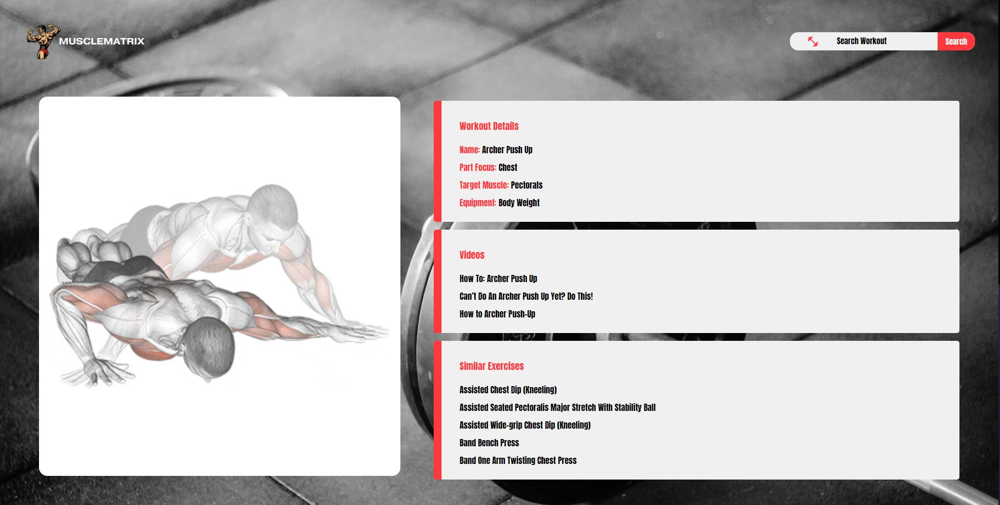

# MuscleMatrix

MuscleMatrix is a web application that serves as a comprehensive guide for fitness enthusiasts. Developed using Angular and using APIs like ExerciseDB and youtube data API v3, it's designed to cater to both novices and experienced gym-goers. Whether you're just starting out on your fitness journey or you're looking to diversify your workout routine, MuscleMatrix has something for you.

## Features

- **Home Page**: Get an overview of what MuscleMatrix offers.
  
- **Bodypart Page**: Select a specific body part you want to focus on.
  
- **Exercise Page**: For each body part, explore a curated list of exercises, complete with GIF representations to ensure you get your form right.
  
  - **Search Functionality**: Find exercises based on specific criteria.
  - **Recommended Exercises**: Not sure where to start? Check out our top picks.
  - **YouTube Redirection**: Want a detailed walkthrough? Click on links that redirect you to informative YouTube videos.

This project was generated with [Angular CLI](https://github.com/angular/angular-cli) version 16.1.5.

## Development server

Run `ng serve` for a dev server. Navigate to `http://localhost:4200/`. The application will automatically reload if you change any of the source files.

## Code scaffolding

Run `ng generate component component-name` to generate a new component. You can also use `ng generate directive|pipe|service|class|guard|interface|enum|module`.

## Build

Run `ng build` to build the project. The build artifacts will be stored in the `dist/` directory.

## Running unit tests

Run `ng test` to execute the unit tests via [Karma](https://karma-runner.github.io).

## Running end-to-end tests

Run `ng e2e` to execute the end-to-end tests via a platform of your choice. To use this command, you need to first add a package that implements end-to-end testing capabilities.

## Further help

To get more help on the Angular CLI use `ng help` or go check out the [Angular CLI Overview and Command Reference](https://angular.io/cli) page.
